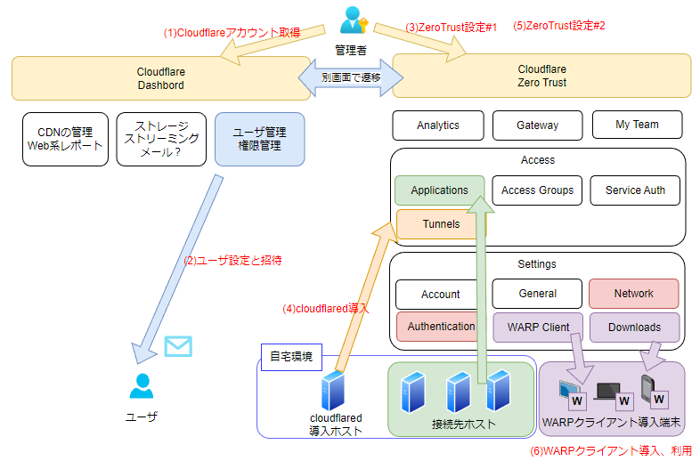
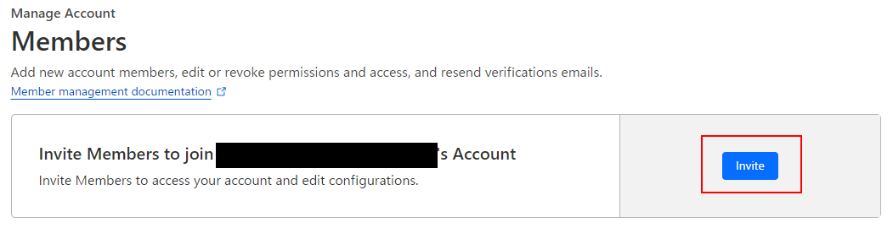
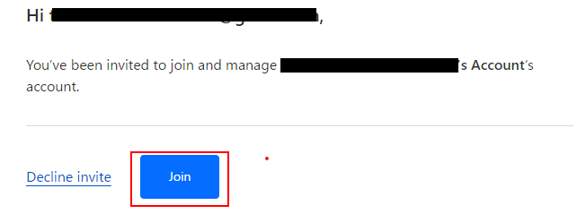
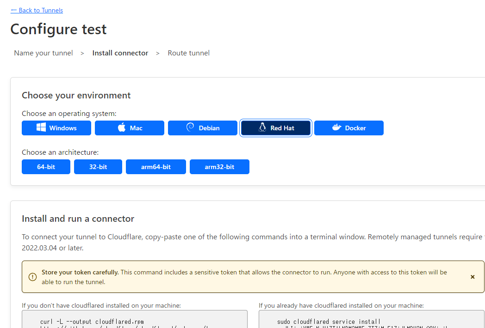
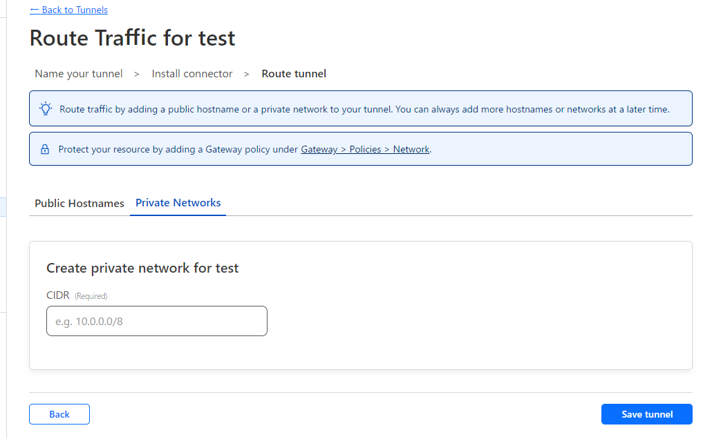
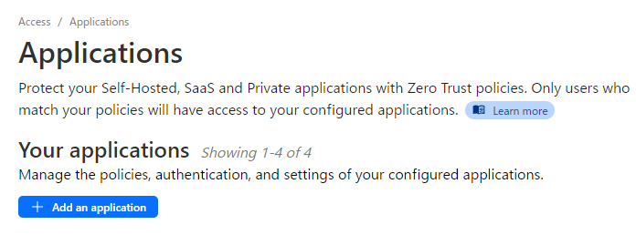
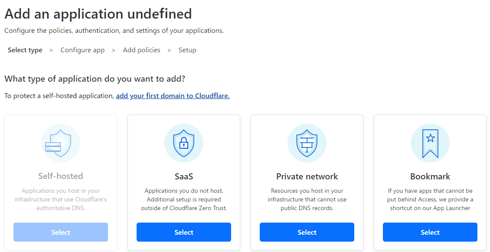
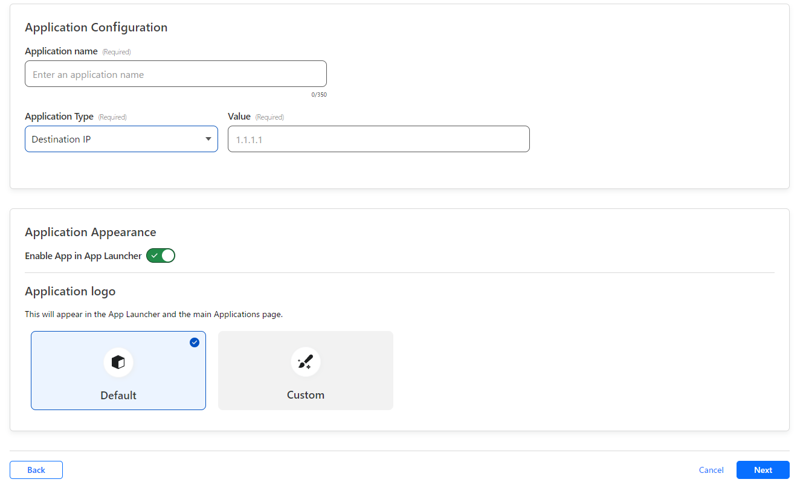
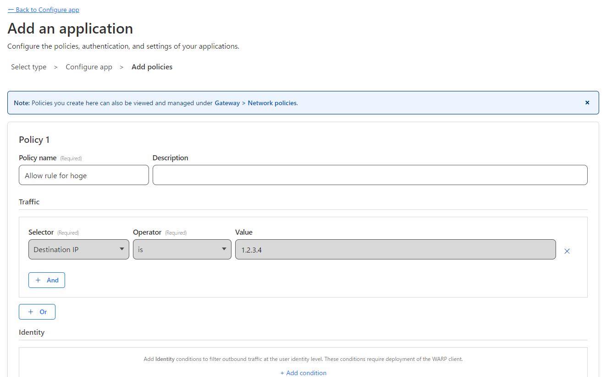
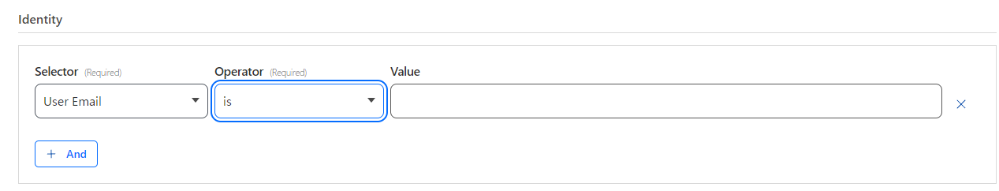

ずいぶん前から、Cloudflareのゼロトラストネットワークのサービスが気になっていました。

だって、50アカウントまで無償で利用できるんですよ、とてもありがたい。

小さい会社であれば無料枠で十分。私なんて1アカウントで十分ですね。

私も出先で仕事することが多い身ということもあり、
重い腰を上げてCloudflareを使ったリモートアクセス環境の構築にチャレンジしました。

いくつか苦労した点はあったものの、実際にリモートから自宅環境にアクセスができましたので、
記録として残しておきます。

## 書いてあること/書いてないこと
インターネット上の記事では、同じ「Cloudflare ゼロトラストネットワーク」という単語でも、書かれている内容が結構異なっている印象があります。 
多いのはSASE系の利用方法に関する記事ですね。

今回、私の記事で書くのは、ポイントを絞って以下の内容です。記事を読み終わると、「書いてあること」ができるようになるはずです。

- 書いてあること
  - CloudflarenoのWARPを使った、コネクターを入れた環境とのリモート接続
  - アカウント管理は外部IdPを利用せず、メールアドレス＋OTP(One Time Password)を利用した接続
- 書いてないこと
  - CloudflareのWebアクセスやDNSフィルタ、TLS復号などSWG系の利用方法
  - EgressPolicyなどIPルーティングに関する話(これはそのうち別記事を書くかも)
  - 企業での利用で想定される外部IdPや複数ユーザやSCIM連携などを用いた運用方法

## 初めに要点
- リモート接続で自宅に入るには以下の設定が必要。
  - WARPクライアントのSplitTunnel設定で、Excludeの初期設定サブネットから自宅環境を外す。
  - リモートから接続を許可する自宅のホストのアドレスを「Applications」で追加する。
    - その際、該当のアプリケーション（ホスト）を利用可能なユーザ識別情報を設定する。
- クライアント側はとりあえずWARPクライアントを入れておき、スイッチのOFF/ONのみで接続手段切り替えが可能

## 事前に準備するもの
- メールアドレス
  - 以下の2種類あったほうが分かりやすいです。gmailで+つけて分けるのはNGっぽい…
    - Cloudflare管理者用のアカウント
    - CloudflareZeroTrust利用者用のアカウント
- cloudflaredを動かすホスト
  - リモート接続先側のトンネルを維持してくれるためのホストです。
  - Windows/Mac/Linuxに対応してます。
  - ソースも提供されてますので、ラズパイとかでもいけるかも。

[:contents]

## 作業の流れ
ここでは「個人アカウントのみを利用し、手動でアカウントを追加する」前提で設定を行う場合の流れを記載します。

- (1)Cloudflare のアカウントを取得する
  - Cloudflare のアカウントを取得する
- (2)利用ユーザを追加し招待メールを送信する
  - 利用ユーザを追加し、権限を付与する
  - 利用ユーザに送られてきたメールのURLにアクセスしレジストする
- (3)Cloudflare ZeroTrustのポータルでやること#1
  - ほげほげ
- (4)ローカル環境にcloudflaredをインストールする
- (5)Cloudflare ZeroTrustのポータルでやること#2
  - 自宅ネットワークの接続先をApplicationsで登録する
  - WARPクライアントのSplitTunnel設定を修正する
- (6)WARPクライアント端末側でやること
  - (2)で作成した利用ユーザ用アカウントでログイン
  - あとはスイッチをONすればリモートから自宅環境へ接続が可能

ざっくりしたイメージを以下に掲載しておきます。

  

>「外部IdPでアカウントを管理しており、その特定グループに所属するユーザには自動的に権限を付与する」のような、会社としての利用方法を行う場合にも、基本的な流れは変わらないと思います。
>ただ、この内容のみでは足りず、少し肉付けが必要と思います。
>なお、私は実利用はAzureADをIdpとして利用しています。

### (1)Cloudflare のアカウントを取得する
#### Cloudflare のアカウントを取得する

以下URLより、Cloudflareのサイトへアクセスし、サインアップします。
https://www.cloudflare.com/ja-jp/

そのままダッシュボードにログインされることを確認します。

>Cloudflare用アカウントでは、gmailの+を使ったエイリアスは+以降なしのものと同一と見なされるようです。

その後、アカウント登録で利用したメールアドレスにベリファイのメールが届きます。
ベリファイ用のURLにアクセスし、再度Cloudflareにログインすればアカウント取得は完了です。

### (2)利用ユーザを追加し招待メールを送信する
#### 利用ユーザを追加し、権限を付与する
「Manage Account」->「Members」をクリックします。

以下のような画面が表示されますので、「Invite」をクリックします。
  

その後画面が切り替わり、以下3種類の項目の入力を求められます。

|項目| 値|
|---| ---|
|Invite members | メンバーのメールアドレスは何か|
|Scope | どのドメインを対象とするか |
|Roles | 該当ユーザにどのような権限を付与するか|
   
- 1つめは利用者のメールアドレスを入力します。
- 2つめは、とりあえず「Include」＋「All domains」でよいでしょう。
- 3つめは、ZeroTrust関連の権限だけ付与したいので、「Minimal Account Access」のみにチェックを入れます。(権限なしにはできない模様)

> 管理者アカウントと同一でもいいと思いますが、どちらの目的のアドレスに来た内容なのか、どの点で制御がかかっているかを混同しそうなので、別アカウントをお勧めします。

#### 利用ユーザに送られてきたメールのURLにアクセスしレジストする

招待したメールアドレスに対し、(1)でのアカウント作成と同様のベリファイ用URLが送付されてくるため、URLにアクセスしてアカウントを作成します。

その後、以下のような画面が表示されますので「Join」をクリックします。

  

これで利用者のレジストまでが完了です。

### (3)Cloudflare ZeroTrustのポータルでやること#1
#### ほげほげ

### (4)ローカル環境にcloudflaredをインストールする
#### 自宅向けトンネルの設定
ZeroTrust側ポータルの管理画面から、「Access」→「Tunnels」をクリックします。

画面上で「Create Tunnel」ボタンをクリックすると、トンネル名を付ける画面が表示されますので、好きな名前を付けます。

その後画面が切り替わり、cloudflaredのインストール用プラットフォームを選択する画面に切り替わりますので、利用されるホストのプラットフォームを選択します。

  

画面下のインストール用コマンドが選択したOS向けのものに切り替わりますので、その内容をコピーします。

#### 自宅環境にcloudflaredをインストールする
前項目でコピーしたコマンドをcloudflared実行環境で実行し、cloudflaredをインストールします。

自動で起動してこない場合、各種OSの操作に合わせてcloudflaredを起動してください。

- DNSによる名前解決
- HTTPSのアウトバウンド
- NTPによる時刻同期
  
このあたりができる環境であれば、問題なくcloudflaredで外部接続できると思います。

HTTPS復号の仕組みが動作している場合、何かしらのFQDNで復号除外が必要になると思います。

#### Connectorが認識されたことを確認し、設定を続行する。
cloudflaredをインストール後、ZeroTrust側ポータルの画面が切り替わり、コネクタのステータスがHEALTHとして表示されることを確認します。（ここは未確認状態でも先に進むことは可能です）

その後、「Next」をクリックします。

以下のような画面に切り替わりますので、自宅環境のサブネットをCIDR形式で入力し、「Save tunnel」をクリックすればトンネル設定は完了です。

  

### (5)Cloudflare ZeroTrustのポータルでやること#2
#### 自宅ネットワークの接続先をApplicationsで登録する
ZeroTrust側のポータルで「Access」→「Applications」をクリックします。

##### Applicationの追加
「Add an application」をクリックすると、Application追加の画面に切り替わります。
  

以下のような画面に切り替わるので、「Private network」を選択します。

  

##### 追加したApplicationの宛先の指定
以下のような登録画面が表示されます。

接続先の目的に合わせて、「NAS」などのお好みのアプリケーション名をつけます。

ApplicationTypeでは、Destination IPを選択します。

Valueに該当ホストのIPを入力し、「Next」をクリックします。

  

##### 追加したApplicationへのアクセス制御
以下のような、アクセス制御を設定する画面に切り替わります。

  

Application登録の際に、以下の2つのNetwork用Access Policyが作成されます。

| 項目 | 目的 | 備考 |
| --- | --- | --- |
| Policy 1 | 許可用のポリシー | Identityの条件を加え、利用ユーザを特定するのが望ましいです。 |
| Policy 2 | 拒否用のポリシー | その他をすべて拒否する、という設定なのでそのままでよいでしょう。 |

利用者を特定するため、Identityの項目を追加し、「User Email」などで利用者の情報を追加します。

> (2)でInviteしたユーザのメールアドレスをここで入力する想定です。

  

入力が完了したら、画面下方にある「Add application」をクリックします。

これを、自宅の接続先分だけ設定します。

CIDRで一括登録できるかは未検証ですが、折角ZeroTrustをやっているので、接続先やユーザは明示するように設定することを推奨します。

#### WARPクライアントのSplitTunnel設定を修正する
最後に、WARPクライアント経由でリモートアクセスするために、SplitTunnelの設定を行います。

> デフォルト設定でClass A/B/Cのローカルアドレスが除外IPとして登録されています。この状態だとWARPクライアント経由でリモート接続されない(クラウド経由でアクセスしてくれない)ので、自宅のIPを除外IPから外す必要があります。

- ZeroTrust側ポータルから、「Settings」→「WARP Client」を選択します。
- 「Device Settings」という項目があるので、→にある「…」をクリックし、「Configure」を選択します。
- いくつかメニューがありますが、その中で「Split Tunnels」を探し、「Manage」をクリックします。
- デフォルトで除外IPが並んでいるので、その中で自宅IPを含むものを削除し、Saveします。

これでSplitTunnel設定は完了です。

> この場合、自宅にいてWARPクライアントを起動している場合、クラウド経由でローカルアクセスする形になります。必要に応じて自宅ではWARPクライアントをDisableするようにしてください。

### (6)WARPクライアント端末側でやること
#### (2)で作成した利用ユーザ用アカウントでログイン
WARPクライアントを起動し、(2)で
#### あとはスイッチをONすればリモートから自宅環境へ接続が可能

## 参考にしたサイト

### 公式
- [https://developers.cloudflare.com/cloudflare-one/:title]

### 個人ブログ

- [https://zenn.dev/hiroe_orz17/articles/650463001ee087:title]
- [https://qiita.com/dodolia907/items/5300ec5b3a584ac72c39:title]

