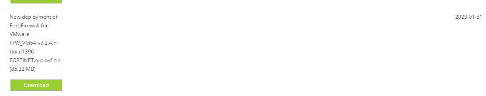
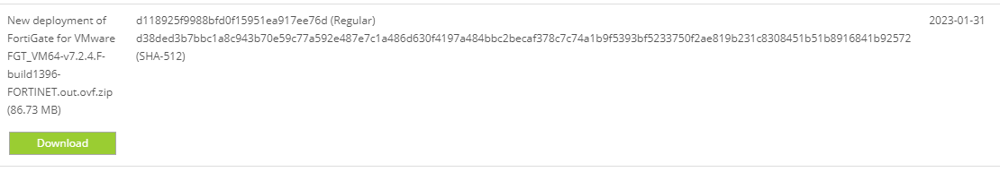

色々と検証をしたいなと考えて、自宅にFortigateのVMを立てようと思っていました。

TLに流れてきた情報から7.2.1以降でライセンスが期限付きから無期限に変更となっているのを知りました。
それなら7.2.x系の最新版、7.2.4を試そうと思い軽い気持ちで取り掛かったものの全くうまくいかず。

いくつかのサイトを見てもすごく簡単に手順がかかれており、なんか自分の環境が悪いのかと思ってましたが、やっと問題点が解消できましたので、共有も込めてブログに書いておきます。

## ポイント
- Webサイトの作りが分かりにくくいので注意すること。
  - Downloadすべきは「FortiVM」のイメージ
    - ページの作り上、「FortiFirewall」が上に並んでいるが、それは別モデルなのでレジストできない
- Trial版の制限で以下の点があるが、レジスト前は考慮する必要なし。レジスト後に勝手に変更される。
  - CPU：1つまで
  - Memory：2GBまで
  - インターフェース：3つまで
  - ポリシー：3つまで

## 手順の流れ
全体の手順の流れの概要を記載します。

- (1)FortiCloudのレジストを行う
- (2)FortiCloud上からVM版のダウンロードを行う
- (3)自身の持つ仮想基盤環境へそれをインポートする
- (4)一度自動で再起動が走る
- (5)パスワード変更とレジスト
  - (5-1)WebUIで操作する場合
    - 自身のport1に付与されたIPアドレスを確認する
      - DHCP環境がある場合はとても楽ですが、固定IPのみの環境でも一部手動設定すれば利用可能になります。
    - WebUIでログインするとパスワード設定を求められるため、パスワードを入力する。
    - ログインすると直後にレジストを求める画面が表示されるため、Trial版のライセンスに変更し(1)で作成したアカウントを入力する
    - 自動的に再起動が始まり、再起動後には制限のかかった環境で起動する。
  - (5-2)CLIで操作する場合
    - コンソールでログインし
    - コンソール上でレジストに必要な情報を定義し、レジスト用のコマンドを入力する。
    - 自動的に再起動が始まり、再起動後には制限のかかった環境で起動する。

だめなほう
  

よいほう
  
